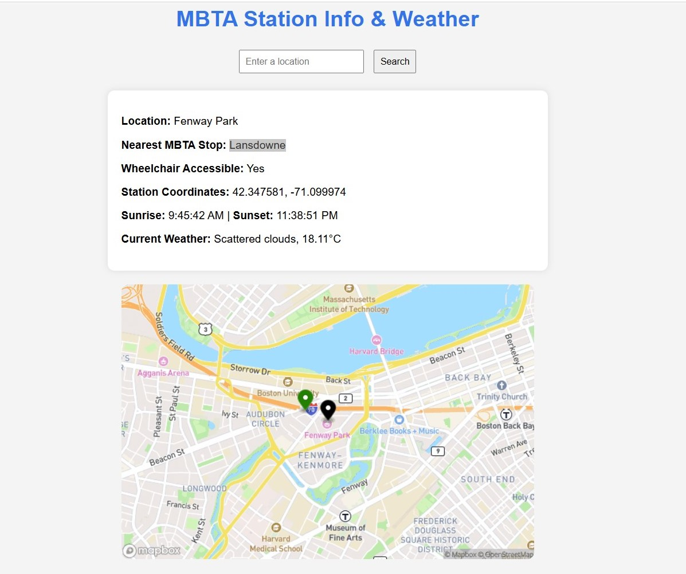

# MBTA-Web-App-Project

This is the base repository for Web App project. Please read the [instructions](instructions.md) for details.

# MBTA Near Me

**Team Members:**  
Stephanie Gutierrez  
Khushi Chindaliya

## 1. Project Overview

This project is a Python-based web API client that allows users in Massachusetts to input a place name and receive information about the nearest MBTA station, including whether it is wheelchair accessible. It uses the Mapbox Geocoding API to convert place names into geographic coordinates and the MBTA API to find nearby public transit stops.

Beyond the base requirements, the project features:
- A clean and user-friendly interface
- A static map showing the user location and nearby station
- Additional information including:
  - **Sunrise and sunset times** using the [Sunrise-Sunset API](https://sunrise-sunset.org/api)
  - **Current weather** using the [OpenWeather API](https://openweathermap.org/api)

The main goal was to integrate multiple APIs, handle JSON responses, and modularize code using reusable functions.

## 2. Reflection

### Development Process

The development process started by understanding the two APIs (Mapbox and MBTA) and how they could connect. One of the things that went well was breaking the problem down into small functions: one for getting JSON data, one for getting coordinates, and another for getting MBTA stops. Using a helper function like `get_json()` made the code cleaner and more reusable.

A major challenge was figuring out how to properly integrate MBTA train stops. At first, it seemed like the problem was with the coordinates or query parameters, but after a lot of debugging and testing, it turned out the issue was actually with the base URL we were using to call the Mapbox API. Once that was corrected, the nearest stations were returned as expected. Printing URLs and testing them manually in a browser helped pinpoint this issue. Having clear documentation for all APIs was also a big help.

Later in the project, we added integration with two additional APIs—**OpenWeather** and **Sunrise-Sunset**—to enhance the user experience with real-time weather and daylight information.

### Team Workflow

This project was completed as a partner project, and the workflow went smoothly throughout. We collaborated on planning out the different parts of the program and divided the work based on our strengths. We both contributed to testing the APIs, writing the core functions, and debugging when things didn’t work as expected. Communication was consistent, and we frequently checked in with each other to make sure our code worked together seamlessly. Overall, the collaboration was effective and balanced, and it made the development process more efficient and enjoyable.

### Learning & AI Tools

Through this project, we gained a better understanding of how to use online tools (APIs) to get real-world data and connect different systems together. We learned how to work with the data these tools return, which is often layered and complex, and how important it is to keep our code organized and easy to check for mistakes. One key takeaway was realizing how small details—like using the wrong kind of number—can prevent things from working properly.

Using ChatGPT and other AI tools was a big help throughout the process. They guided us when we got stuck, offered clearer ways to write parts of our program, and helped us understand what we were seeing in the data. These tools also supported us in integrating the weather and sunrise/sunset APIs smoothly and effectively.

### Final Output with Working Station

